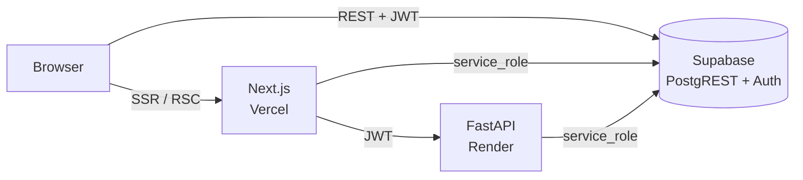
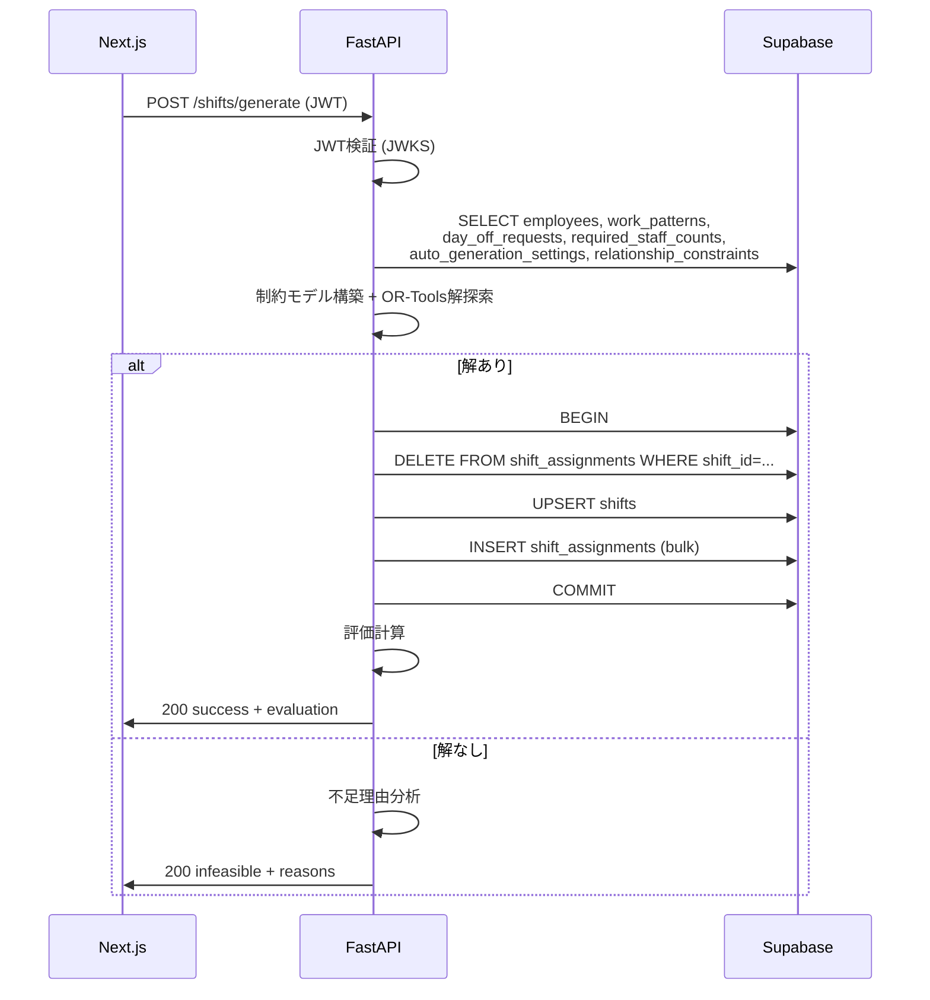

# API設計書

## 1. 概要

### 1.1 方針

- **通常のCRUD**：Next.js から Supabase クライアントSDK (`@supabase/supabase-js`) を経由して PostgREST を直接呼び出す。アクセス制御は RLS が担保する
- **シフト生成・評価**：Python FastAPI（Render）に委譲する。OR-Tools のソルバー処理を Node から分離するため
- **特殊処理（招待メール、サービス間連携）**：Next.js Server Actions / Route Handlers で `service_role` キーを使い、サーバーサイドからのみ実行する
- **Excel出力**：クライアント側で SheetJS を使ってブラウザ内生成（API化しない）

### 1.2 技術構成

| 役割 | ランタイム | デプロイ先 |
|---|---|---|
| Webフロント | Next.js 14 App Router | Vercel |
| 認証 + DB + RLS | Supabase | Supabase Cloud |
| シフト生成エンジン | Python 3.11 FastAPI | Render |

---

## 2. アーキテクチャ

### 2.1 通信パターン



### 2.2 認証

- **フロント認証**：Supabase Auth（メールアドレス + パスワード）
  - クライアント側は `@supabase/supabase-js` がトークンを自動管理
  - ログイン後の JWT が `Authorization: Bearer <jwt>` として PostgREST に送信され、RLS の `auth.uid()` 等で評価される
- **Next.js → FastAPI**：同じ Supabase JWT を Bearer で送信
  - FastAPI は Supabase の JWKS で署名検証し、`sub` を `auth.uid()` 相当として扱う
- **FastAPI → Supabase**：`service_role` キーで Postgres 直接または PostgREST を呼ぶ
  - service_role は RLS をバイパスするため、データ取得・保存はサーバーサイド責任で行う

### 2.3 認証ヘッダ仕様

| 経路 | ヘッダ | 値 |
|---|---|---|
| Browser → Supabase | `Authorization` | `Bearer <user-jwt>` |
| Browser → Supabase | `apikey` | `<anon-key>` |
| Next.js Server → FastAPI | `Authorization` | `Bearer <user-jwt>` |
| Next.js Server → Supabase | `Authorization` | `Bearer <service-role-key>`（招待などの管理操作） |
| FastAPI → Supabase | `Authorization` | `Bearer <service-role-key>` |

---

## 3. データアクセス層（Supabase 直接呼び出し）

各テーブルへのCRUDは PostgREST 経由で行う。詳細な権限は [db_design.md 4.1 RLS権限マトリクス](./db_design.md#41-権限マトリクス) を参照。本書では画面操作との対応のみ記載する。

### 3.1 employees

| 利用画面 | 操作 | 経路 | 備考 |
|---|---|---|---|
| O-01 | SELECT | Browser → Supabase | RLS により office は自店舗、manager / staff は自部門に絞り込み |
| O-02 新規 | INSERT + Auth Invite | **Server Action**（後述 6.1） | 招待メール送信に service_role が必要 |
| O-02 編集 | UPDATE | Browser → Supabase | 異動時の人間関係制約自動無効化はDBトリガ |
| O-02 無効化 | UPDATE `is_active=false` | Browser → Supabase | 「最後の有効 office」はフロントで disabled |

### 3.2 stores / departments / work_patterns

| 利用画面 | 操作 | 経路 |
|---|---|---|
| O-02、F-01 | SELECT | Browser → Supabase |
| F-01 勤務パターンタブ | INSERT / UPDATE / DELETE | Browser → Supabase（manager のみ可、RLS で担保） |

`stores` / `departments` の編集UIは本MVP対象外（運用CLIまたはマイグレーションで管理）。

### 3.3 shift_settings

| 利用画面 | 操作 | 経路 |
|---|---|---|
| F-01 基本設定タブ | SELECT | Browser → Supabase |
| F-01 基本設定タブ | UPDATE | Browser → Supabase（manager のみ） |

シングルトン（`id = 1` のみ）のため、UPDATE のみで INSERT は行わない（マイグレーションで初期投入）。

### 3.4 required_staff_counts / auto_generation_settings

| 利用画面 | 操作 | 経路 |
|---|---|---|
| F-01 必要人数・自動生成条件タブ | SELECT | Browser → Supabase |
| F-01 必要人数・自動生成条件タブ | INSERT / UPDATE / DELETE | Browser → Supabase（manager 自部門のみ） |

### 3.5 relationship_constraints

| 利用画面 | 操作 | 経路 |
|---|---|---|
| F-01 人間関係制約タブ | SELECT | Browser → Supabase |
| F-01 人間関係制約タブ | INSERT / UPDATE | Browser → Supabase（manager 自部門のみ） |

スタッフ異動時の自動無効化は `employees` 更新トリガで処理する（DB側）。

### 3.6 day_off_requests

| 利用画面 | 操作 | 経路 | RLS制約 |
|---|---|---|---|
| F-02 staff モード | SELECT / INSERT / UPDATE / DELETE | Browser → Supabase | 自分のレコードのみ、かつ締切前のみ |
| F-02 manager モード | SELECT / INSERT / UPDATE / DELETE | Browser → Supabase | 自部門のレコード、締切前後問わず |

締切判定は DB ファンクション `is_day_off_editable(target_date)` を staff の WITH CHECK 内で参照する。

### 3.7 shifts / shift_assignments

| 利用画面 | 操作 | 経路 | 備考 |
|---|---|---|---|
| F-03 閲覧 | SELECT | Browser → Supabase | RLS で表示範囲制御 |
| F-03 編集（手動） | UPDATE / INSERT / DELETE on `shift_assignments` | Browser → Supabase | 楽観ロックは shifts.updated_at で実装 |
| F-03 公開切替 | UPDATE on `shifts.status` | Browser → Supabase | manager のみ |
| F-03 生成 | （後述 6.2 generateShift） | Server Action → FastAPI | |

#### 楽観ロックの呼び出し例

```typescript
const { error } = await supabase
  .from('shift_assignments')
  .update({ staff_id: newStaffId })
  .eq('id', assignmentId)
  .eq('shifts.updated_at', expectedUpdatedAt) // 親 shifts の updated_at と一致確認
```

実装は親 shifts.updated_at を比較するファンクションラッパー（RPC）を用意するのが推奨。

---

## 4. FastAPI エンドポイント

### 4.1 ベース仕様

- ベースURL：`https://<render-host>/api/v1`
- 認証：`Authorization: Bearer <Supabase JWT>`
- リクエスト/レスポンス：`application/json`
- 文字コード：UTF-8
- エラー形式：[7.1 共通エラー形式](#71-共通エラー形式) 参照

### 4.2 POST `/shifts/generate`

対象年月のシフトを自動生成する。

#### リクエスト

```json
{
  "target_year_month": "2026-06-01",
  "store_id": "8e0f...",
  "department_id": "1234...",
  "version": "v8",
  "overwrite_existing": true
}
```

| フィールド | 型 | 必須 | 説明 |
|---|---|---|---|
| target_year_month | string (date) | ✓ | 対象月の月初日 (YYYY-MM-01) |
| store_id | uuid | ✓ | 店舗ID |
| department_id | uuid | ✓ | 部門ID |
| version | string | | 生成段階。省略時は最新版（`v8`） |
| overwrite_existing | bool | | true で既存シフト上書き。省略時は false |

#### レスポンス（成功）`200 OK`

```json
{
  "status": "success",
  "shift_id": "abcd...",
  "assignments_count": 150,
  "evaluation": {
    "day_off_violations": 0,
    "required_staff_shortage": 0,
    "required_staff_excess": 0,
    "consecutive_violations": 0,
    "soft_constraint_violations": 1,
    "per_staff": [
      {
        "staff_id": "...",
        "workdays": 18,
        "weekend_workdays": 5,
        "monthly_minutes": 8640
      }
    ],
    "fairness": {
      "by_employment_type": {
        "正社員": { "stddev_workdays": 0.5, "stddev_minutes": 60 },
        "パート": { "stddev_workdays": 1.2, "stddev_minutes": 120 }
      }
    }
  }
}
```

#### レスポンス（生成不可）`200 OK`

```json
{
  "status": "infeasible",
  "reasons": [
    {
      "type": "staff_shortage",
      "target_date": "2026-06-15",
      "work_pattern_id": "...",
      "work_pattern_name": "午前",
      "required": 3,
      "available_candidates": 1,
      "shortage_breakdown": {
        "day_off_blocked": 1,
        "consecutive_limit_blocked": 0,
        "pattern_mismatch_blocked": 1
      }
    }
  ]
}
```

`reasons[].type` の値：

| type | 説明 |
|---|---|
| staff_shortage | 必要人数を満たせない |
| day_off_excess | 希望休制約により候補不足 |
| consecutive_limit | 連勤制限による候補不足 |
| pattern_mismatch | 勤務パターン制約による候補不足 |

#### エラー応答

| HTTP | コード | 説明 |
|---|---|---|
| 400 | `validation_failed` | リクエスト不正（store/department/対象年月の形式不正等） |
| 401 | `unauthorized` | JWT 不正・期限切れ |
| 403 | `forbidden` | 自部門外のシフトを生成しようとした（manager のみ自部門） |
| 409 | `shift_already_exists` | 既存シフトあり、`overwrite_existing=false` |
| 500 | `internal_error` | ソルバー異常終了等 |

### 4.3 POST `/shifts/{shift_id}/evaluate`

既存シフトを再評価する。手動編集後に呼び出す想定。

#### リクエスト

ボディなし。

#### レスポンス `200 OK`

```json
{
  "shift_id": "...",
  "evaluation": {
    "day_off_violations": 0,
    "required_staff_shortage": 0,
    "required_staff_excess": 0,
    "consecutive_violations": 0,
    "soft_constraint_violations": 1,
    "per_staff": [ ... ],
    "fairness": { ... }
  }
}
```

`evaluation` の構造は [4.2 generate](#42-post-shiftsgenerate) と同じ。

#### エラー応答

| HTTP | コード | 説明 |
|---|---|---|
| 401 | `unauthorized` | JWT 不正 |
| 403 | `forbidden` | 自部門外 |
| 404 | `shift_not_found` | shift_id に該当なし |

### 4.4 GET `/health`

ヘルスチェック。Render の Healthcheck Endpoint として利用。

#### レスポンス `200 OK`

```json
{ "status": "ok", "version": "1.0.0" }
```

---

## 5. シフト生成 内部処理フロー

`POST /shifts/generate` の処理フロー：



`shifts.status` は `'draft'` で保存。manager が F-03 から公開操作で `'published'` に切替える。

---

## 6. Next.js Server Actions / Route Handlers

クライアントから直接呼べないサーバー側処理。

### 6.1 `inviteEmployee(input)`

スタッフ登録（O-02 新規）に対応。

#### 入力

```typescript
type InviteEmployeeInput = {
  email: string
  store_id: string
  role: 'office' | 'manager' | 'staff'
  // role別の追加項目
  last_name?: string
  first_name?: string
  account_name?: string  // office用
  department_id?: string | null
  employment_type?: '正社員' | '契約社員' | 'パート' | 'アルバイト'
  work_pattern_id?: string | null
  monthly_max_workdays?: number | null
  max_consecutive_workdays?: number  // デフォルト4
  is_active?: boolean
}
```

#### 処理

1. ロール別バリデーション（office用のダミー値補完を含む）
2. office の場合：対象店舗に有効な office が存在しないことを確認
3. Supabase Auth Admin API で招待メール送信（`auth.admin.inviteUserByEmail`）
4. `auth.users.id` を取得
5. `public.employees` に INSERT（`id = auth.users.id`）
6. 成功時は employees レコードを返す

#### エラーケース

- メールアドレス重複
- office 重複（1店舗1office制約違反）
- バリデーションエラー

### 6.2 `generateShift(input)`

F-03 シフト生成ボタンに対応する FastAPI ラッパー。

#### 入力

```typescript
type GenerateShiftInput = {
  target_year_month: string  // YYYY-MM-01
  store_id: string
  department_id: string
  overwrite_existing?: boolean
}
```

#### 処理

1. ユーザーJWTを取得
2. FastAPI の `POST /shifts/generate` を呼び出し
3. レスポンスをそのままクライアントに返す
4. ネットワークエラーは `internal_error` でラップ

### 6.3 `evaluateShift(shift_id)`

手動編集後の再評価（F-03 で「再評価」ボタン押下時、または編集確定時）。

FastAPI の `POST /shifts/{shift_id}/evaluate` を呼ぶラッパー。

### 6.4 `disableEmployee(employee_id)`

スタッフ無効化（O-02 無効化ボタン）。

最後の有効 office アカウント無効化のチェックをサーバー側で再確認してから UPDATE する。

---

## 7. 共通仕様

### 7.1 共通エラー形式

```json
{
  "error": "<error_code>",
  "message": "<human readable message>",
  "details": { ... }
}
```

| エラーコード | HTTP | 説明 |
|---|---|---|
| `unauthorized` | 401 | 未認証または JWT 不正 |
| `forbidden` | 403 | 認可エラー |
| `not_found` | 404 | リソース不在 |
| `validation_failed` | 400 | 入力バリデーションエラー |
| `conflict` | 409 | 状態競合（楽観ロック等） |
| `shift_already_exists` | 409 | 既存シフトあり、上書き不許可 |
| `shift_not_found` | 404 | shift_id 不在 |
| `internal_error` | 500 | サーバー内部エラー |

### 7.2 日付・時刻形式

- 日付：`YYYY-MM-DD`（ISO 8601）
- 日時：`YYYY-MM-DDTHH:mm:ss±HH:MM`（ISO 8601、原則 JST `+09:00`）
- target_year_month：`YYYY-MM-01`（月初日）

### 7.3 ID 形式

- すべて UUID v4 文字列（小文字ハイフン区切り）

### 7.4 バージョニング

- FastAPI のパスに `/api/v1/` を含める
- 破壊的変更時は `/api/v2/` を新設し、旧版を一定期間並行運用

### 7.5 ページング

MVPでは想定データ量が小さい（30名 × 1ヶ月 = ~900件）ため、ページングは未実装。  
将来必要になった場合は `?limit=50&offset=0` 形式で追加する。

---

## 8. セキュリティ

### 8.1 通信

- 全経路 HTTPS 強制
- HSTS 有効化（Vercel / Render の標準設定）

### 8.2 CORS

- FastAPI の Allowed Origins：本番フロント origin のみ
- preflight キャッシュ：86400秒

### 8.3 シークレット管理

| 環境変数 | 用途 | 配置先 |
|---|---|---|
| `SUPABASE_URL` | Supabase エンドポイント | Vercel / Render |
| `SUPABASE_ANON_KEY` | フロント認証用 | Vercel（公開可） |
| `SUPABASE_SERVICE_ROLE_KEY` | サーバー専用 | Vercel Server / Render（秘匿） |
| `SUPABASE_JWT_SECRET` または JWKS URL | JWT検証 | Render |

### 8.4 レート制限

- FastAPI：`slowapi` 等で 60 req/min/user を上限に設定
- シフト生成エンドポイントは 10 req/min/user に絞る（重い処理のため）

### 8.5 ログ

- リクエスト ID（`X-Request-Id`）を全経路で伝播
- 個人情報は出力しない（メールアドレス、氏名はマスク）
- エラーログには user_id、request_id、エラーコードのみ含める

---

## 9. 補足

### 9.1 画面・DBとの対応

| 画面ID | 主な操作 | API経路 |
|---|---|---|
| C-01〜C-04 | 認証 | Supabase Auth API（直接） |
| C-05 | ロール判定 | `auth.uid()` + employees SELECT |
| F-01 | 設定タブごとのCRUD | Supabase 直接（テーブル別） |
| F-02 staff | 希望休 CRUD | Supabase 直接、RLS で締切判定 |
| F-02 manager | 希望休 CRUD（締切後可） | Supabase 直接 |
| F-03 閲覧 | shifts/shift_assignments SELECT | Supabase 直接 |
| F-03 生成 | シフト生成 | `generateShift()` → FastAPI |
| F-03 編集 | shift_assignments UPDATE | Supabase 直接（楽観ロック） |
| F-03 再評価 | 評価再計算 | `evaluateShift()` → FastAPI |
| F-03 公開 | shifts.status UPDATE | Supabase 直接 |
| O-01 | employees SELECT | Supabase 直接 |
| O-02 新規 | 招待 + INSERT | `inviteEmployee()` Server Action |
| O-02 編集 | employees UPDATE | Supabase 直接 |
| O-02 無効化 | employees UPDATE | `disableEmployee()` Server Action |

### 9.2 Excel 出力

クライアント側で SheetJS により生成し、`Blob` をダウンロード。サーバー側API化は行わない。

### 9.3 リアルタイム更新

MVPでは未対応。  
将来、シフト編集の同時編集体験を改善する場合は Supabase Realtime（`shifts` / `shift_assignments` の変更通知購読）を追加する。
