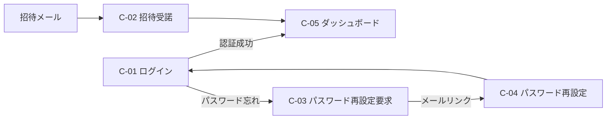
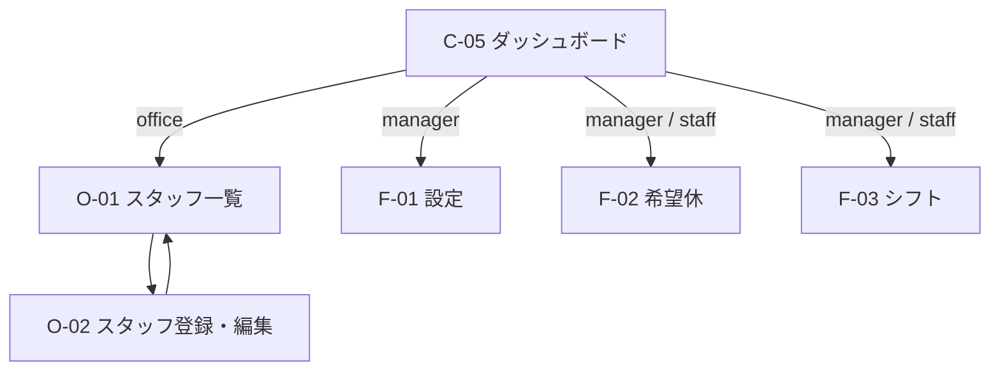

# 画面設計書

## 1. 概要

### 1.1 方針

- フレームワーク：Next.js 14 App Router
- 対象ロール：`office` / `manager` / `staff` の3種類
- レスポンシブ対応：PC・スマートフォン両対応
  - スタッフ用画面（希望休入力、シフト閲覧）はスマートフォン優先
  - 管理者用画面（スタッフ管理、シフト編集、設定）はPC優先
- 認証：Supabase Auth（メールアドレス + パスワード）

### 1.2 ロール別の責務（DB設計の権限マトリクスに準拠）

| ロール | 担当 |
|---|---|
| office | スタッフの登録・編集・無効化のみ（設定・希望休・シフトには関与しない） |
| manager | 基本設定・勤務パターン・必要人数・自動生成条件・人間関係制約の管理／希望休一覧（自部門・締切後編集含む）／自部門のシフト生成・編集・公開 |
| staff | 希望休入力（自分のみ、締切前のみ）／シフト閲覧（自店舗自部門の公開分のみ） |

office担当者本人がシフト対象スタッフでもある場合は、別途staffロールのアカウント（別メールアドレス）で希望休入力・シフト閲覧を行う。

### 1.3 画面構成方針

機能ごとの画面を最小化し、**同一URLでロール別に挙動を切り替える**方針とする。  
合計10画面に集約：

- 共通（認証・ダッシュボード）：5画面
- 機能画面：3画面（ロール別挙動）
- スタッフ管理（office 専用）：2画面

---

## 2. 画面一覧

| ID | 画面名 | パス | アクセス | 概要 |
|---|---|---|---|---|
| C-01 | ログイン | `/login` | 未認証 | メールとパスワードで認証 |
| C-02 | 招待受諾 | `/invite/accept` | 招待トークン | 初回パスワード設定 |
| C-03 | パスワード再設定要求 | `/password/forgot` | 未認証 | リセットメール送信 |
| C-04 | パスワード再設定 | `/password/reset` | リセットトークン | 新パスワード設定 |
| C-05 | ダッシュボード | `/dashboard` | 全認証ロール | ロール別メニュー表示 |
| F-01 | 設定 | `/settings` | manager | タブで全設定を1画面に統合 |
| F-02 | 希望休 | `/day-off` | manager / staff | staff:入力 / manager:自部門一覧（締切後編集含む） |
| F-03 | シフト | `/shifts` | manager / staff | 生成・一覧・編集・公開を1画面に統合 |
| O-01 | スタッフ一覧 | `/staffs` | office | スタッフ一覧・絞り込み |
| O-02 | スタッフ登録・編集 | `/staffs/new`, `/staffs/[id]` | office | 同一フォームで新規・編集 |

---

## 3. 画面遷移図

### 3.1 認証フロー

### 3.2 ロール別の主導線

---

## 4. 画面別詳細

### 4.1 共通画面

#### C-01 ログイン (`/login`)

- 入力：メールアドレス / パスワード
- アクション：ログイン、パスワード再設定リンク

#### C-02 招待受諾 (`/invite/accept?token=...`)

- 表示：招待先メールアドレス、初回パスワード設定の案内
- 入力：パスワード / 確認用パスワード
- アクション：パスワード設定 → 自動ログイン → ダッシュボード

#### C-03 パスワード再設定要求 (`/password/forgot`)

- 入力：メールアドレス
- アクション：リセットメール送信

#### C-04 パスワード再設定 (`/password/reset`)

- 入力：新パスワード / 確認用
- アクション：パスワード更新 → ログイン画面へ

#### C-05 ダッシュボード (`/dashboard`)

- ヘッダ：ユーザー名、ロールバッジ、ログアウト
- ロール別メニュー：

| ロール | メニュー |
|---|---|
| office | スタッフ管理 |
| manager | 設定 / 希望休 / シフト |
| staff | 希望休 / シフト |

### 4.2 機能画面

#### F-01 設定 (`/settings`) — manager 専用

タブで全設定を1画面に統合。

| タブ | 内容 | スコープ |
|---|---|---|
| 基本設定 | 希望休締切日、希望休上限日数 | 全店共通（RU） |
| 勤務パターン | 勤務パターンCRUD | 全店共通 |
| 必要人数 | 平日・休日 × 勤務パターン | 自店舗自部門 |
| 自動生成条件 | 制約フラグ | 自店舗自部門 |
| 人間関係制約 | スタッフペア | 自店舗自部門 |

##### 共通動作

- 各タブ内で保存ボタンを押すと該当データのみ更新（タブ切替で未保存変更があれば確認モーダル）
- 必要人数・自動生成条件・人間関係制約は、自店舗自部門で固定表示

##### 各タブ操作

###### 基本設定タブ

- 入力：希望休入力締切日（前月の何日、1〜28）/ 希望休上限日数
- アクション：保存
- 補足：全店共通シングルトン。最終更新者と更新日時を表示

###### 勤務パターンタブ

- 表示：名前、開始時刻、終了時刻、休憩（分）、実働（分）、有効/無効
- アクション：新規登録、編集、有効/無効切替
- 補足：全店共通

###### 必要人数タブ

- 表示・入力：平日・休日 × 勤務パターンのマトリクス（自店舗自部門固定）
- アクション：保存

###### 自動生成条件タブ

- 入力：チェックボックス（希望休ハード制約 / 最大連勤 / 1日1シフト / 勤務パターン制約 / 人間関係soft / 公平性）
- アクション：保存
- 補足：未実装の制約は disabled で表示

###### 人間関係制約タブ

- 表示：スタッフA、スタッフB、理由、有効/無効、登録日
- 絞り込み：有効/無効、スタッフ名検索
- アクション：新規登録（モーダル）、編集、有効/無効切替
- 補足：UNIQUE制約により同一ペアの重複登録は不可。再登録は無効化レコードの再有効化で対応する旨をガイド表示

#### F-02 希望休 (`/day-off`)

ロールに応じて2つのモードに分岐。

##### staff モード（入力）

- セレクタ：対象年月
- 表示：
  - カレンダー（当月）
  - 締切日カウントダウン
  - 上限日数 / 残り日数
- アクション：
  - 日付タップで希望休 ON/OFF
  - 上限超過時はエラートースト
  - 締切後は読み取り専用化
- スマートフォンUX重視

##### manager モード（自部門一覧 + 締切後編集）

- セレクタ：対象年月（部門は自部門固定）
- 表示モード切替：スタッフ別 / 日付別
- 表示項目：
  - スタッフ別：スタッフ × 日付のヒートマップ
  - 日付別：日付ごとの希望休スタッフ一覧
- 集計：日別希望休件数
- アクション：締切後の希望休追加・変更（モーダル）

#### F-03 シフト (`/shifts`)

シフト生成・一覧・編集・公開を1画面に統合。

##### 共通要素

- セレクタ：対象年月（部門は自店舗自部門で固定）
- 表示モード切替：日付 × 勤務パターン / 日付 × スタッフ
- ステータスバッジ：下書き / 公開
- Excel出力ボタン

##### ロール別の挙動

| 操作 | manager | staff |
|---|---|---|
| 閲覧 | 自店舗自部門 | 自店舗自部門 かつ `published` のみ |
| 生成ボタン | ✓ | × |
| 手動編集モード | ✓ | × |
| 公開／非公開切替 | ✓ | × |
| Excel出力 | ✓（自部門） | ✓（自部門） |

##### 生成フロー（manager）

- 「生成」ボタン → 対象年月の現状確認
  - シフト未作成 → 生成確認モーダル → API呼び出し
  - シフト存在 → 上書き確認モーダル（手動編集が失われる旨を警告）
- 生成中：プログレス表示
- 生成成功：同画面でシフト表が表示される
- 生成失敗：原因リストをモーダルまたはバナーで表示
  - 人員不足の日付・勤務パターン・必要人数・割当可能人数
  - 希望休による候補者不足
  - 勤務パターンによる候補者不足
  - 連勤制限による候補者不足

##### 編集モード（manager）

- セルクリック → スタッフ割当モーダル（候補者リストに警告アイコン：希望休／連勤超過／勤務パターン不一致）
- 楽観ロック競合：「他のユーザーが更新しました」モーダル → 再読込
- 必要人数不足／超過、希望休違反等を画面上にハイライト表示

##### 評価情報（manager）

シフト表の下部に評価サマリを表示：

- 希望休違反数
- 必要人数不足／超過数
- 連勤制限違反数
- 人間関係soft制約違反数
- スタッフ別 勤務日数 / 土日出勤回数 / 月間労働時間

### 4.3 office 専用画面

#### O-01 スタッフ一覧 (`/staffs`)

- 表示：氏名（姓 名）、メール、店舗、部門、雇用区分、勤務パターン、有効/無効
- 絞り込み：店舗 / 部門 / 雇用区分 / 有効・無効
- 並び替え：氏名、部門、雇用区分
- アクション：新規登録ボタン、行クリック → O-02 詳細・編集

#### O-02 スタッフ登録・編集 (`/staffs/new`, `/staffs/[id]`)

新規・編集を共通フォームで実装。

- 入力項目：
  - 姓 / 名（必須）
  - メールアドレス（必須・新規時のみ入力可、編集時は readonly。変更は Auth API 経由）
  - 所属店舗（必須）
  - 役割（office / manager / staff）
  - 所属部門（office 役割選択時のみ NULL 可）
  - 雇用区分（必須）
  - 勤務パターン（staff / manager 役割選択時必須、office は省略可）
  - 月間最大勤務日数
  - 最大連勤日数（デフォルト 4）
  - 有効 / 無効
- アクション：
  - 新規：登録ボタン → Supabase Auth 招待メール送信 → 一覧へ
  - 編集：保存ボタン → 一覧へ
  - 編集：無効化／再有効化ボタン
- 補足：
  - 異動（部門変更）時は人間関係制約の自動無効化警告を表示
  - パスワードはここでは扱わない（Auth 招待リンク経由のみ）

---

## 5. 共通UI要素

### 5.1 グローバルヘッダ

- 認証後レイアウトでのみ表示
- 左：ロゴ・アプリ名
- 中央：対象年月セレクタ（必要な画面のみ）
- 右：ユーザー名・ロールバッジ・ログアウト

### 5.2 サイドナビ

- 認証後レイアウトでのみ表示。未認証画面（C-01〜C-04）には表示しない
- ダッシュボード（C-05）のロール別メニューと同内容
- PC・タブレットでは常時表示。スマホ（767px以下）ではハンバーガーメニューとして格納し、タップで開閉

### 5.3 対象年月セレクタ

- 月送り（前月／次月ボタン）+ 年月ピッカー
- デフォルト：当月
- セッション中は選択値を保持

### 5.4 共通コンポーネント

- データテーブル（ソート・フィルタ・ページング）
- モーダル（削除確認 / 上書き確認 / フォーム入力）
- トースト通知（成功 / エラー / 情報）
- ローディング（スケルトン推奨）
- バリデーションエラー表示（React Hook Form + Zod）
- 警告バッジ（希望休違反、人数不足など）

### 5.5 アクセス制御

- middleware（Next.js）で未認証アクセスを `/login` へリダイレクト
- ロール非対応ページへのアクセスは `/dashboard` へリダイレクト
- 自部門外データへのアクセスは RLS で遮断（API側）

### 5.6 レイアウト構成

| レイアウト | 対象画面 | ヘッダ | サイドナビ |
|---|---|---|---|
| 認証レイアウト | C-01〜C-04 | × | × |
| 認証後レイアウト | C-05・F-01〜F-03・O-01〜O-02 | ✓ | ✓（PC常時、スマホはハンバーガー） |

---

## 6. レスポンシブ方針

| デバイス | レイアウト | 主対象画面 |
|---|---|---|
| PC（1024px以上） | サイドナビ + メイン | 管理者画面全般、シフト編集、設定 |
| タブレット（768〜1024px） | 折りたたみサイドナビ + メイン | 全画面 |
| スマホ（767px以下） | ハンバーガー + 全幅メイン | 希望休入力、シフト閲覧 |

- シフト表は幅が広いため、スマホでは横スクロール表示
- 希望休入力カレンダーはスマホで親指操作しやすいタップサイズを確保

---

## 7. 補足

### 7.1 画面とAPIの対応

各画面で必要なエンドポイントは別途「API設計書」に記載する。本書は画面の表示・操作仕様に専念する。

### 7.2 スタイル方針

- TailwindCSS + Radix UI ベース
- カラーパレット：シンプルな業務系（ニュートラル系をベース、警告は黄、エラーは赤）
- アクセシビリティ：キーボード操作、スクリーンリーダー対応を意識する

### 7.3 ローカライズ

- 多言語対応は要件外。日本語固定とする。
